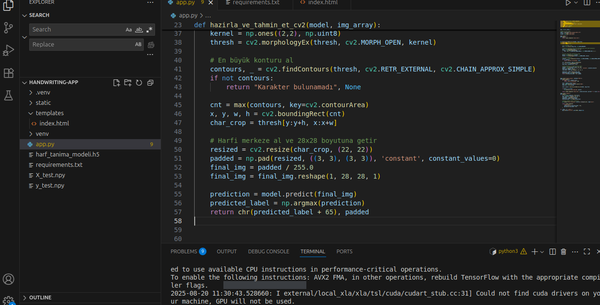
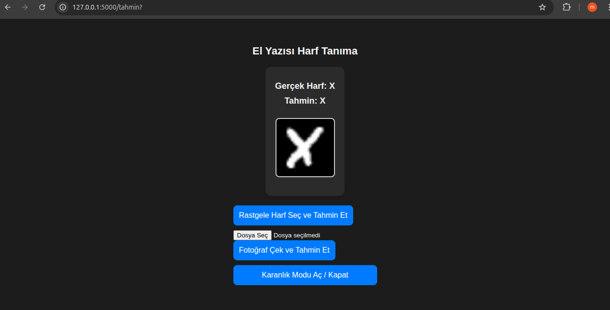

# Handwriting Character Recognition App ✍️

This project is a **Flask-based web application** that recognizes handwritten characters from images.  
It was originally developed in Google Colab for training and testing the model, and later deployed in a Flask environment for real-world usage.

---

## 🚀 Features
- Upload an image and get the predicted character.
- Live camera input support for handwritten character recognition.
- Pretrained deep learning model (`harf_tanima_modeli.h5`) integrated into Flask.
- Clean preprocessing pipeline with **OpenCV** (grayscale, thresholding, contour detection, resizing).
- Lightweight web interface with prediction results displayed.

---

## 🛠️ Tech Stack
- **Python 3**
- **Flask** – backend web framework
- **TensorFlow / Keras** – deep learning model
- **OpenCV** – image preprocessing
- **NumPy** – data manipulation
- **Pillow (PIL)** – image handling
- **Matplotlib** – visualization (optional)

---

## 📂 Project Structure
```
Character-Project/
│
├── app.py # Main Flask application
├── requirements.txt # Dependencies
├── static/ # Saved images, CSS, etc.
├── templates/ # HTML templates
├── model-training/ # Training notebooks and scripts
└── .gitignore
```
## 📷 Screenshots

### Home Page


### Prediction Example



## 👤 Author
- **Mustafa Esen**  
  [GitHub](https://github.com/mustafaaesen) | [LinkedIn](www.linkedin.com/in/mustafaesen) | ✉️ mustafaaeesen@gmail.com

